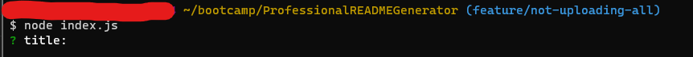
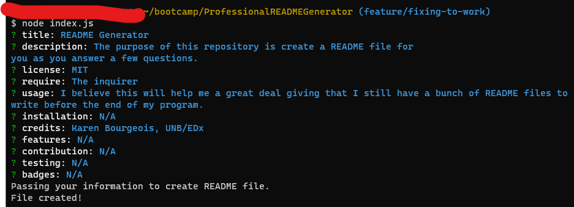
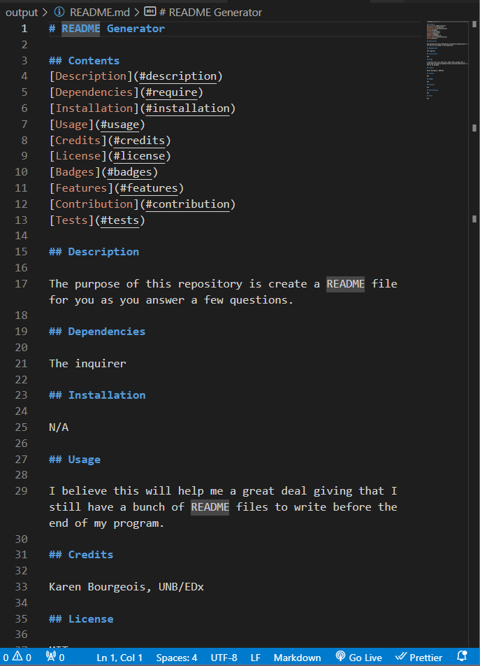
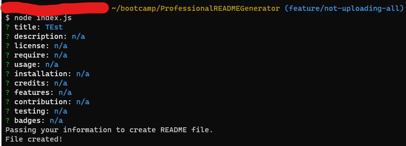
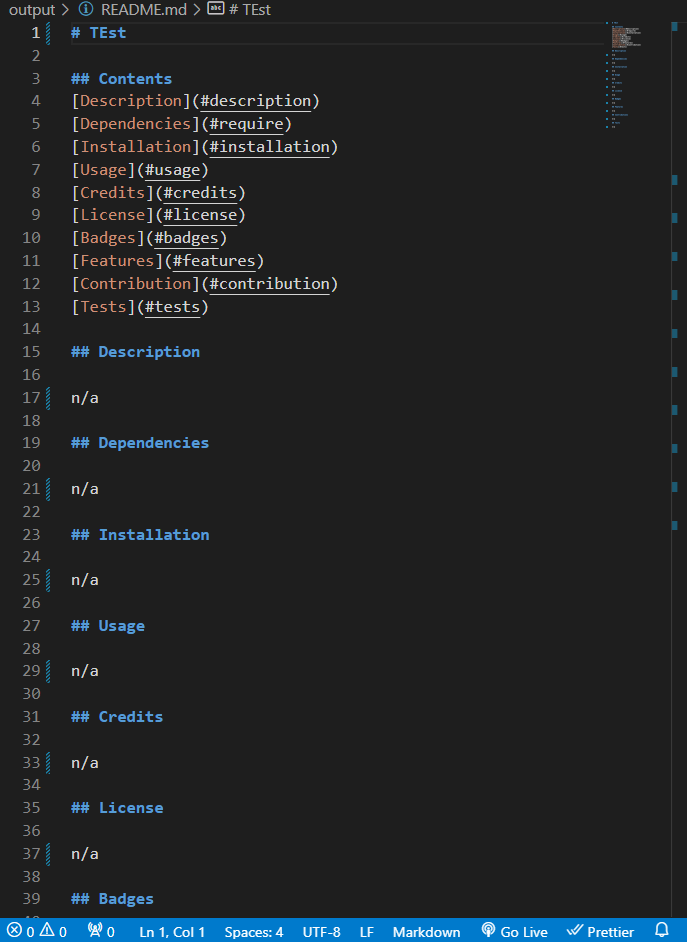

# ProfessionalREADMEGenerator

## Description

This is an application that will generate a professional README file for your repository. Who wants all their hard work to be down-played by a README file that doesn't stand up to all the work your've put into it? This application will help you along the way.

## User Story

AS A developer
I WANT a README generator
SO THAT I can quickly create a professional README for a new project

## Acceptance Criteria

- GIVEN a command-line application that accepts user input

- WHEN I am prompted for information about my application repository
- THEN a high-quality, professional README.md is generated with the title of my project and sections entitled Description, Table of Contents, Installation, Usage, License, Contributing, Tests, and Questions
- WHEN I enter my project title
- THEN this is displayed as the title of the README
- WHEN I enter a description, installation instructions, usage information, contribution guidelines, and test instructions
- THEN this information is added to the sections of the README entitled Description, Installation, Usage, Contributing, and Tests

- WHEN I choose a license for my application from a list of options
- THEN a badge for that license is added near the top of the README and a notice is added to the section of the README entitled License that explains which license the application is covered under

- WHEN I enter my GitHub username
- THEN this is added to the section of the README entitled Questions, with a link to my GitHub profile
- WHEN I enter my email address
- THEN this is added to the section of the README entitled Questions, with instructions on how to reach me with additional questions
- WHEN I click on the links in the Table of Contents
- THEN I am taken to the corresponding section of the README (There is no sound)
[Video of working progrm](https://youtu.be/GR0KK61eaPY) 

## Table of Contents

- [Installation](#installation)
- [Usage](#usage)
- [Credits](#credits)
- [Badges](#badges)

## Installation

There is no installation needed.

## Usage

The purpose of this application is to show my ability with node.js. It will also help those looking to have a clean and professional README file to show their work off.

## Credits

- Karen Bourgeois https://github.com/kzefram,
- UNB/Edx,
- https://www.joshwcomeau.com/css/custom-css-reset/

## Badges

https://github.com/users/kzefram/achievements/quickdraw

https://github.com/users/kzefram/achievements/pull-shark

https://github.com/users/kzefram/achievements/yolo

## Testing

I tested to get the pictures and video to upload

This is the out put of it
